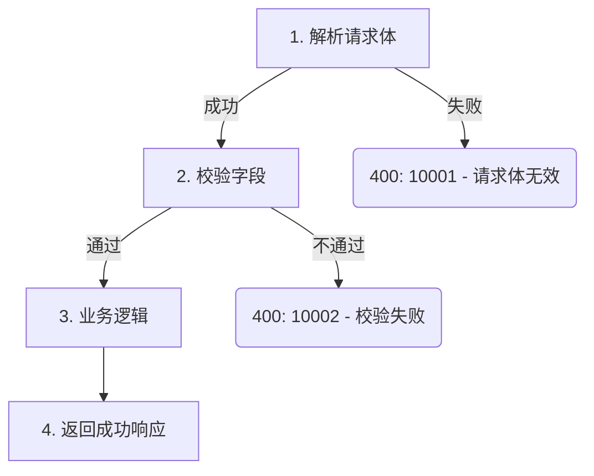

# Generalize doc_gen Node Implementation Plan

> **For agentic workers:** REQUIRED SUB-SKILL: Use superpowers:subagent-driven-development (recommended) or superpowers:executing-plans to implement this plan task-by-task. Steps use checkbox (`- [ ]`) syntax for tracking.

**Goal:** Generalize the `doc_gen` node to support API, cron, and message-queue handler documentation by making the config type-aware and the prompt template conditional.

**Architecture:** The `.doc_gen.yaml` config's `modules.mapping` values change from plain strings to `{name, type}` objects. The Pydantic model adds a `ModuleEntry` with backward-compat normalization. The `doc_gen` system prompt is restructured: role generalized, step 3 extracts type, step 7 uses conditional template sections. No graph topology or tool interface changes.

**Tech Stack:** Python 3.11+, Pydantic v2, PyYAML, LangChain, LangGraph, pytest

---

### Task 1: Add `ModuleEntry` Model and Update `ModulesConfig`

**Files:**
- Modify: `src/tools/config_reader.py:57-72`
- Create: `tests/tools/test_config_reader.py`

- [ ] **Step 1: Write failing tests for new config format**

Create `tests/tools/test_config_reader.py` with tests that cover:
1. New format (mapping values are `{name, type}` objects)
2. Backward-compatible format (mapping values are plain strings → default to `type: "api"`)
3. Validation: invalid type value is accepted (no enum restriction for extensibility)

```python
"""Tests for src.tools.config_reader Pydantic models."""

import json
from unittest.mock import patch

import pytest
import yaml


@pytest.fixture()
def docs_dir(tmp_path):
    """Create a temporary docs_space_dir and patch settings."""
    with patch("src.tools.config_reader.settings") as mock_settings:
        mock_settings.docs_space_dir = str(tmp_path)
        yield tmp_path


def _write_config(docs_dir, project: str, config: dict) -> str:
    """Write a .doc_gen.yaml and return the config_path."""
    project_dir = docs_dir / project
    project_dir.mkdir(parents=True, exist_ok=True)
    config_file = project_dir / ".doc_gen.yaml"
    config_file.write_text(yaml.dump(config), encoding="utf-8")
    return f"{project}/.doc_gen.yaml"


def test_new_format_with_type(docs_dir):
    """Mapping values as {name, type} objects are parsed correctly."""
    from src.tools.config_reader import load_docgen_config

    config_path = _write_config(docs_dir, "proj", {
        "modules": {
            "mapping": {
                "proj/api/logic": {"name": "order", "type": "api"},
                "proj/cron/handler": {"name": "sync", "type": "cron"},
                "proj/mq/handler": {"name": "events", "type": "mq"},
            }
        },
        "search_rules": {
            "function_patterns": [r"func\s+(\w+)"],
            "struct_patterns": [r"type\s+(\w+)\s+struct"],
        },
    })

    result = json.loads(load_docgen_config.invoke({"config_path": config_path}))

    assert result["success"] is True
    mapping = result["payload"]["modules"]["mapping"]
    assert mapping["proj/api/logic"] == {"name": "order", "type": "api"}
    assert mapping["proj/cron/handler"] == {"name": "sync", "type": "cron"}
    assert mapping["proj/mq/handler"] == {"name": "events", "type": "mq"}


def test_backward_compat_string_format(docs_dir):
    """Plain string mapping values are normalized to {name: str, type: 'api'}."""
    from src.tools.config_reader import load_docgen_config

    config_path = _write_config(docs_dir, "proj", {
        "modules": {
            "mapping": {
                "proj/logic": "order",
            }
        },
        "search_rules": {
            "function_patterns": [r"func\s+(\w+)"],
            "struct_patterns": [r"type\s+(\w+)\s+struct"],
        },
    })

    result = json.loads(load_docgen_config.invoke({"config_path": config_path}))

    assert result["success"] is True
    mapping = result["payload"]["modules"]["mapping"]
    assert mapping["proj/logic"] == {"name": "order", "type": "api"}


def test_mixed_format(docs_dir):
    """Mixing string and object values in the same mapping works."""
    from src.tools.config_reader import load_docgen_config

    config_path = _write_config(docs_dir, "proj", {
        "modules": {
            "mapping": {
                "proj/api/logic": "order",
                "proj/cron/handler": {"name": "sync", "type": "cron"},
            }
        },
        "search_rules": {
            "function_patterns": [r"func\s+(\w+)"],
            "struct_patterns": [r"type\s+(\w+)\s+struct"],
        },
    })

    result = json.loads(load_docgen_config.invoke({"config_path": config_path}))

    assert result["success"] is True
    mapping = result["payload"]["modules"]["mapping"]
    assert mapping["proj/api/logic"] == {"name": "order", "type": "api"}
    assert mapping["proj/cron/handler"] == {"name": "sync", "type": "cron"}


def test_type_defaults_to_api(docs_dir):
    """Object mapping without explicit type defaults to 'api'."""
    from src.tools.config_reader import load_docgen_config

    config_path = _write_config(docs_dir, "proj", {
        "modules": {
            "mapping": {
                "proj/logic": {"name": "order"},
            }
        },
        "search_rules": {
            "function_patterns": [r"func\s+(\w+)"],
            "struct_patterns": [r"type\s+(\w+)\s+struct"],
        },
    })

    result = json.loads(load_docgen_config.invoke({"config_path": config_path}))

    assert result["success"] is True
    mapping = result["payload"]["modules"]["mapping"]
    assert mapping["proj/logic"] == {"name": "order", "type": "api"}


def test_empty_mapping_rejected(docs_dir):
    """Empty mapping dict is rejected."""
    from src.tools.config_reader import load_docgen_config

    config_path = _write_config(docs_dir, "proj", {
        "modules": {"mapping": {}},
        "search_rules": {
            "function_patterns": [r"func\s+(\w+)"],
            "struct_patterns": [r"type\s+(\w+)\s+struct"],
        },
    })

    result = json.loads(load_docgen_config.invoke({"config_path": config_path}))

    assert result["success"] is False
    assert "mapping" in result["error"].lower() or "不能为空" in result["error"]
```

- [ ] **Step 2: Run tests to verify they fail**

Run: `pytest tests/tools/test_config_reader.py -v`
Expected: FAIL — the new format tests fail because `ModulesConfig.mapping` is `dict[str, str]` and cannot accept dict values.

- [ ] **Step 3: Implement `ModuleEntry` and update `ModulesConfig`**

In `src/tools/config_reader.py`, add the `ModuleEntry` model and update `ModulesConfig`:

```python
class ModuleEntry(BaseModel):
    """单个模块条目。

    Attributes:
        name: 模块名称。
        type: 处理函数类型，如 "api"、"cron"、"mq"。默认为 "api"。
    """

    name: str
    type: str = "api"


class ModulesConfig(BaseModel):
    """模块映射配置。

    Attributes:
        mapping: 扫描路径到模块条目的映射字典，至少包含一项。
                 值可以是 ModuleEntry 对象或纯字符串（向后兼容，自动转为 type="api"）。
    """

    mapping: dict[str, ModuleEntry]

    @field_validator("mapping", mode="before")
    @classmethod
    def normalize_mapping_values(cls, v: dict) -> dict:
        """将纯字符串值归一化为 ModuleEntry 格式。"""
        if not isinstance(v, dict):
            return v
        normalized = {}
        for key, val in v.items():
            if isinstance(val, str):
                normalized[key] = {"name": val, "type": "api"}
            else:
                normalized[key] = val
        return normalized

    @field_validator("mapping")
    @classmethod
    def mapping_must_not_be_empty(cls, v: dict[str, ModuleEntry]) -> dict[str, ModuleEntry]:
        """确保 mapping 至少包含一项。"""
        if not v:
            raise ValueError("mapping 不能为空")
        return v
```

Key changes:
- New `ModuleEntry` model with `name: str` and `type: str = "api"`
- `ModulesConfig.mapping` type changed from `dict[str, str]` to `dict[str, ModuleEntry]`
- Added `normalize_mapping_values` validator with `mode="before"` that converts plain string values to `{"name": val, "type": "api"}` dicts
- Existing `mapping_must_not_be_empty` validator preserved (now validates after normalization)

Also update the module docstring to reflect the new `ModuleEntry`:
- In the docstring's `Models:` section, add `ModuleEntry` description
- Update `ModulesConfig` description from "路径到模块名称的映射" to "路径到模块条目的映射"
- Update the `Example .doc_gen.yaml` in the docstring to show both formats

- [ ] **Step 4: Run tests to verify they pass**

Run: `pytest tests/tools/test_config_reader.py -v`
Expected: All 6 tests PASS

- [ ] **Step 5: Run full test suite to check for regressions**

Run: `pytest -v`
Expected: All existing tests PASS (backward-compat validator ensures old string format still works)

- [ ] **Step 6: Commit**

```bash
git add src/tools/config_reader.py tests/tools/test_config_reader.py
git commit -m "feat: add ModuleEntry model for type-aware module mapping"
```

---

### Task 2: Update Template Config

**Files:**
- Modify: `template/.doc_gen.yaml`

- [ ] **Step 1: Update template to show new format**

Replace the content of `template/.doc_gen.yaml` with:

```yaml
# 文档生成配置

# 模块配置
modules:
  # 模块映射：路径 -> 模块条目
  # type 支持: "api"（HTTP接口，默认）、"cron"（定时任务）、"mq"（消息订阅）
  # 纯字符串值向后兼容，等价于 {name: 字符串值, type: "api"}
  mapping:
    "ubill-access-api/ubill-order/logic":
      name: "order"
      type: "api"
    "ubill-access-api/ubill-transaction/logic":
      name: "transaction"
      type: "api"
    "ubill-access-api/ubill-resource/logic":
      name: "resource"
      type: "api"
    "ubill-access-api/ubill-surround/logic":
      name: "surround"
      type: "api"

# 搜索规则
search_rules:
  # 函数匹配模式（正则表达式）
  function_patterns:
    - 'http\.HandlerFunc\(\s*([a-zA-Z_][a-zA-Z0-9_]*)\s*\)'
  # 结构体定义匹配模式（正则表达式）
  struct_patterns:
    - '^\s*([a-zA-Z_][a-zA-Z0-9_]*)\s+struct\s*\{'
```

- [ ] **Step 2: Commit**

```bash
git add template/.doc_gen.yaml
git commit -m "docs: update template config with type-aware module mapping"
```

---

### Task 3: Generalize the `doc_gen` System Prompt

**Files:**
- Modify: `src/prompts/system/doc_gen.md`

This is the largest change. The prompt needs three modifications: generalize the role, extract type in step 3, and add conditional template in step 7.

- [ ] **Step 1: Generalize role description and constraints (lines 1-6)**

Replace the opening section:

**Before:**
```markdown
你是一个专业的 Go API 文档生成助手。

你的职责：
- 分析 Go 源代码，提取 API 接口信息
- 生成结构化、格式一致的 Markdown API 文档
```

**After:**
```markdown
你是一个专业的 Go 代码文档生成助手。

你的职责：
- 分析 Go 源代码，提取处理函数的逻辑信息
- 生成结构化、格式一致的 Markdown 处理逻辑文档
- 根据处理函数的类型（API 接口、定时任务、消息订阅等）自动调整文档结构
```

Keep the constraints unchanged — they are already generic ("仅文档化导出函数" etc.).

- [ ] **Step 2: Update step 1 description (line 31-40)**

Change the user input example to be more generic. Replace:

```markdown
示例：用户输入"帮我生成 ubill-access-api/ubill-order/logic/BuyResource.go 的 API 文档"
→ 项目名称 = `ubill-access-api`，文件路径 = `ubill-access-api/ubill-order/logic/BuyResource.go`
```

With:

```markdown
示例：用户输入"帮我生成 ubill-access-api/ubill-order/logic/BuyResource.go 的文档"
→ 项目名称 = `ubill-access-api`，文件路径 = `ubill-access-api/ubill-order/logic/BuyResource.go`
```

- [ ] **Step 3: Update step 3 to extract type (lines 55-62)**

Replace step 3:

**Before:**
```markdown
### 步骤 3：确定模块

用 `modules.mapping` 的 key 与文件路径进行前缀匹配，确定模块名。

**匹配策略**：最长前缀匹配——当多个 key 都能匹配文件路径时，取最长的那个。

示例：文件路径 `ubill-access-api/ubill-order/logic/BuyResource.go`
匹配 `ubill-access-api/ubill-order/logic` → 模块名 `order`

如果没有任何 key 能匹配，必须告知用户该文件不属于已配置的模块，并终止流程。
```

**After:**
```markdown
### 步骤 3：确定模块和类型

用 `modules.mapping` 的 key 与文件路径进行前缀匹配，确定模块信息。

**匹配策略**：最长前缀匹配——当多个 key 都能匹配文件路径时，取最长的那个。

匹配成功后，从对应的值中提取：
- **模块名**（`name` 字段）
- **类型**（`type` 字段）：`api`（HTTP 接口）、`cron`（定时任务）、`mq`（消息订阅）等

示例：文件路径 `ubill-access-api/ubill-order/logic/BuyResource.go`
匹配 `ubill-access-api/ubill-order/logic` → 模块名 `order`，类型 `api`

**记住这个类型值，在步骤 7 生成文档时会用到。**

如果没有任何 key 能匹配，必须告知用户该文件不属于已配置的模块，并终止流程。
```

- [ ] **Step 4: Restructure step 7 with conditional template (lines 119-156)**

Replace the step 7 section. Keep step 7a (执行流程分析) unchanged. Update step 7b to be type-aware:

**Before (7b):**
```markdown
**7b. 按文档模板生成 Markdown 文档**

按照下方「文档模板」部分的结构生成完整文档。
```

**After (7b):**
```markdown
**7b. 按文档模板生成 Markdown 文档**

根据步骤 3 中确定的**类型**，选择对应的文档模板生成文档：

- **所有类型**都必须包含：概述、执行流程（含 Mermaid 流程图）、错误码
- **仅 `api` 类型**额外包含：请求参数、响应、请求示例、响应示例

按照下方「文档模板」部分的结构生成文档。模板中标注了 `[仅 api 类型]` 的章节，在非 `api` 类型时跳过。
```

- [ ] **Step 5: Update the document template section (lines 158-233)**

Replace the document template section:

**Before:**
```markdown
## 文档模板

生成的每份文档必须严格遵循以下结构：

# <API 名称>

## 概述
简要描述该 API 的功能和主要使用场景。

## 请求参数
...
## 响应
...
## 执行流程
...
## 错误码
...
## 请求示例
...
## 响应示例
...
```

**After:**
```markdown
## 文档模板

生成的每份文档必须严格遵循以下结构。标注 `[仅 api 类型]` 的章节仅在类型为 `api` 时生成，其他类型跳过。

# <处理函数名称>

## 概述
简要描述该处理函数的功能和主要使用场景。

## 请求参数 [仅 api 类型]

| 参数 | 类型 | 必填 | 描述 |
|------|------|------|------|
| paramName | string | 是 | 参数说明 |

## 响应 [仅 api 类型]

| 字段 | 类型 | 描述 |
|------|------|------|
| fieldName | string | 字段说明 |

## 执行流程



## 错误码

| 错误码 | 触发条件 | 描述 |
|--------|----------|------|
| 10001 | 输入无效 | 详细说明该错误何时发生 |

## 请求示例 [仅 api 类型]

```bash
curl -X POST http://internal-api-test03.service.ucloud.cn \
  -H "Content-Type: application/json" \
  -d '{
    "field": "value"
  }'
```

## 响应示例 [仅 api 类型]

```json
{
    "code": 0,
    "message": "success",
    "data": {
        "field": "value"
    }
}
```
```

- [ ] **Step 6: Update quality rules (lines 220-234)**

Keep all existing rules. Add one new rule and generalize language:

Add at the end of the quality rules:
```markdown
- 非 `api` 类型不得包含请求参数、响应、请求示例、响应示例章节
```

Update rule that says "请求示例使用 curl 格式" to:
```markdown
- [仅 api 类型] 请求示例使用 curl 格式，基于实际结构体定义填写合理的字段值
```

Update rule that says "请求示例使用固定 URL" to:
```markdown
- [仅 api 类型] 请求示例使用固定 URL `http://internal-api-test03.service.ucloud.cn`，不追加路径段，仅填写 `-d` 中的请求体字段
```

Update rule that says "响应示例必须反映" to:
```markdown
- [仅 api 类型] 响应示例必须反映实际的响应结构体，不使用泛化占位符
```

- [ ] **Step 7: Update step 6 completeness check (lines 114-117)**

The three completeness questions at the end of step 6 are API-specific. Make them conditional:

**Before:**
```markdown
本步骤**未完成**，除非你能完整回答以下三个问题：
- 请求和响应结构体的每个字段是什么（包括所有嵌套类型）？
- 所有错误返回路径、触发条件和错误码是什么？
- 核心逻辑流程是什么，每个步骤调用了哪些子函数？
```

**After:**
```markdown
本步骤**未完成**，除非你能完整回答以下问题：
- [仅 api 类型] 请求和响应结构体的每个字段是什么（包括所有嵌套类型）？
- 所有错误返回路径、触发条件和错误码是什么？
- 核心逻辑流程是什么，每个步骤调用了哪些子函数？
- 输入参数和输出结果分别是什么？
```

- [ ] **Step 8: Verify prompt reads correctly end-to-end**

Read the full modified prompt file to verify consistency, no dangling references to "API 文档" that should be generalized, and the flow from step 1 through step 9 makes sense for all types.

- [ ] **Step 9: Commit**

```bash
git add src/prompts/system/doc_gen.md
git commit -m "feat: generalize doc_gen prompt for api/cron/mq handler types"
```

---

### Task 4: Update Module Docstring in config_reader.py

**Files:**
- Modify: `src/tools/config_reader.py:1-37`

- [ ] **Step 1: Update module docstring**

Update the module-level docstring to reflect the new `ModuleEntry` model:

**Before (relevant parts):**
```python
"""读取并校验 .doc_gen.yaml 项目配置。

...

Models:
    ModulesConfig     — 路径到模块名称的映射
    SearchRulesConfig — API 函数与结构体定义识别的正则模式
    DocgenConfig      — 顶层配置，组合以上两个子模型
...

Example .doc_gen.yaml::

    modules:
      mapping:
        "ubill-access-api/ubill-order/logic": "order"
        "ubill-access-api/ubill-transaction/logic": "transaction"
...
"""
```

**After:**
```python
"""读取并校验 .doc_gen.yaml 项目配置。

本模块提供 Pydantic 数据模型和一个 LangChain Tool 函数，用于从
docs_space_dir 下加载文档生成配置文件（.doc_gen.yaml），校验其结构完整性后
返回结构化配置。config_path 参数为相对于 docs_space_dir 的路径。

工具与编程语言无关，适用于任何包含 .doc_gen.yaml 的项目。

Models:
    ModuleEntry       — 单个模块条目（名称 + 类型）
    ModulesConfig     — 路径到模块条目的映射
    SearchRulesConfig — 函数与结构体定义识别的正则模式
    DocgenConfig      — 顶层配置，组合以上两个子模型

Tool:
    load_docgen_config — 读取指定路径的 .doc_gen.yaml 并返回配置字典

Usage::

    from src.tools.config_reader import load_docgen_config

    # LLM Agent 通过 tool 调用
    result = load_docgen_config.invoke({
        "config_path": "ubill-access-api/.doc_gen.yaml"
    })

Example .doc_gen.yaml::

    modules:
      mapping:
        "ubill-access-api/ubill-order/logic":
          name: "order"
          type: "api"
        "ubill-access-api/ubill-cron/handler":
          name: "sync"
          type: "cron"
    search_rules:
      function_patterns:
        - 'http\\.HandlerFunc\\(\\s*([a-zA-Z_][a-zA-Z0-9_]*)\\s*\\)'
      struct_patterns:
        - 'type\\s+([a-zA-Z_][a-zA-Z0-9_]*)\\s+struct\\s*\\{'
"""
```

- [ ] **Step 2: Commit**

```bash
git add src/tools/config_reader.py
git commit -m "docs: update config_reader docstring for ModuleEntry"
```

---

### Task 5: Final Verification

**Files:** None (verification only)

- [ ] **Step 1: Run full test suite**

Run: `pytest -v`
Expected: All tests PASS, including the 6 new tests in `test_config_reader.py`

- [ ] **Step 2: Verify prompt file is well-formed**

Run: Read `src/prompts/system/doc_gen.md` end-to-end and confirm:
- No orphaned references to "API 文档" that should say "文档"
- `[仅 api 类型]` markers are present on all API-specific sections
- Steps 1-9 flow is coherent for all three types (api, cron, mq)

- [ ] **Step 3: Verify config template is valid YAML**

Run: `python -c "import yaml; yaml.safe_load(open('template/.doc_gen.yaml')); print('OK')"`
Expected: `OK`

- [ ] **Step 4: Verify Pydantic model accepts template config**

Run: `python -c "from src.tools.config_reader import DocgenConfig; import yaml; c = yaml.safe_load(open('template/.doc_gen.yaml')); DocgenConfig(**c); print('OK')"`
Expected: `OK`
