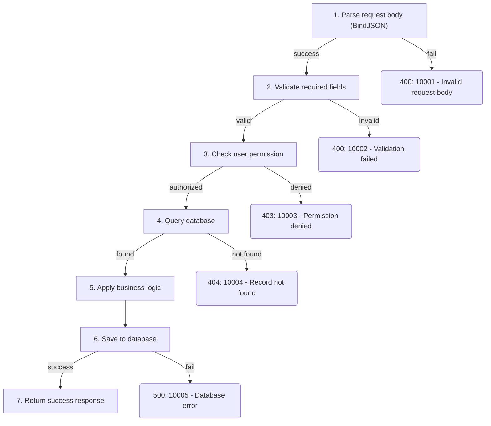

# doc_gen Prompt: Recursive Context Building & Execution Flow

**Date:** 2026-03-12
**Status:** Approved

## Problem

The current doc_gen system prompt (v2, from 2026-03-11) has two shortcomings:

1. **Task 1 (Deep Reading) is a passive checklist.** It lists what to read (structs, helpers, sub-functions) but doesn't give the LLM a systematic exploration strategy. The LLM may stop reading prematurely, missing deeply nested dependencies or cross-package references.

2. **No execution flow documentation.** The generated docs describe parameters, responses, and error codes in isolation, but don't show how the API actually executes—the step-by-step path from request to response, including where each error can occur. This makes it hard to understand the relationship between steps, conditions, and errors.

## Solution

### Workflow Change: 3-Task → 4-Task

```
Old: Task 1 Deep Reading → Task 2 Generate Docs → Task 3 Save
New: Task 1 Recursive Context Building → Task 2 Execution Flow Analysis → Task 3 Generate Documentation → Task 4 Save
```

### Task 1: Recursive Context Building

Replace the passive checklist with an explicit queue-driven exploration loop:

- Maintain **Resolved** (fully read) and **Unresolved** (discovered but not yet read) lists
- Loop: read a file → extract references → add new ones to Unresolved → pick next → repeat until Unresolved is empty
- Track these reference types:
  1. Request/response struct definitions (including nested structs)
  2. Business logic functions and helper methods called by the handler
  3. Custom error types and error code constants
  4. Middleware or interceptors referenced by the handler
  5. Interfaces and their implementations
- The LLM should output its current Resolved/Unresolved state after each `read_file` call to maintain tracking across ReAct loop iterations
- Termination: LLM must be able to fully answer these 3 self-check questions:
  1. What is every field in the request and response structs (including all nested types)?
  2. What are all the error return paths, their trigger conditions, and error codes?
  3. What is the core logic flow, and what sub-functions does each step call?

### Task 2: Execution Flow Analysis (New)

A pure analysis step between reading and writing. The LLM produces a structured text analysis:

- **Happy Path:** step-by-step from request entry to successful response, noting which function/method each step calls
- **Branches & Error Exits:** for each step, list all failure conditions with their error codes, HTTP status codes, and error messages
- Completion: every step in the main flow is listed, every error exit for every step is covered

**Architecture note:** The 4 "tasks" are phases within a single system prompt, not separate graph nodes. The LLM executes all tasks within one ReAct session. Tasks 1 and 4 involve tool calls (`read_file`/`scan_directory` and `save_document`). Tasks 2 and 3 are internal reasoning that happens within the same LLM turn(s) that ultimately produce the `save_document` tool call. The `route_doc_gen` routing (END on no tool calls) is not affected because the LLM will always have a `save_document` call pending after Task 3.

### Task 3: Generate Documentation (Modified)

Added responsibility: convert Task 2's analysis into a Mermaid flowchart:

- Main path: rectangle nodes `["step description"]`
- Branches/conditions: use edge labels (`-->|condition|`) rather than diamond nodes (avoids `{`/`}` brace-escaping conflicts with `ChatPromptTemplate`)
- Error exits: rounded nodes `("error_code: description")`
- Success path flows top-down; error branches go left or right
- Error codes in the flowchart must match the Error Codes table exactly

### Task 4: Save (Unchanged)

Same as current Task 3.

## Documentation Template Change

New section **Execution Flow** added between Response and Error Codes:

```
# API Name
## Overview
## Request Parameters
## Response
## Execution Flow          ← NEW
## Error Codes
## Request Example
## Response Example
```

The Execution Flow section contains a Mermaid `flowchart TD` diagram showing all steps and error branches.

### Mermaid Example



### Mermaid Syntax Rules

- Always quote node labels with double quotes to avoid syntax conflicts with special characters
- Use `["label"]` for step nodes, `("label")` for error exit nodes
- Use edge labels (`-->|condition|`) for branching instead of diamond nodes (avoids brace-escaping issues with `ChatPromptTemplate`)
- Keep node labels concise; use numbered steps for readability

### Quality Rules Added

- Execution Flow Mermaid diagram must cover all steps and error branches identified in Task 2
- Error codes in the flowchart must be consistent with the Error Codes table
- Use `flowchart TD` (top-down) direction

## Design Decisions

| Decision | Choice | Rationale |
|----------|--------|-----------|
| Reading strategy | Explicit queue (Resolved/Unresolved) | More systematic than natural language guidance; clear termination condition prevents premature stopping |
| Flow analysis timing | Separate Task 2 after reading, before writing | Pure analysis step (like chain-of-thought) produces higher quality than analyzing while reading or while formatting |
| Flow visualization | Mermaid flowchart | Rich enough to show branches and error exits; widely rendered in Markdown viewers |
| Execution Flow position | Between Response and Error Codes | Flow branches correspond to error codes below; reading them together is natural |
| Task 2 output format | Free-form text analysis | Letting LLM focus on logic completeness without worrying about Mermaid syntax during analysis |

## What Doesn't Change

- Role description and constraints (exported functions only, no fabrication, inferred marking)
- Request Parameters, Response, Error Codes table formats
- Request/Response example formats (curl + JSON)
- Existing quality rules (exact Go types, validation tags, nested struct handling)
- Save behavior (module name inference, `save_document` tool)

## Risks and Mitigations

| Risk | Mitigation |
|------|------------|
| Recursive reading consumes too many tokens for large APIs | The prompt should instruct the LLM to prioritize depth over breadth: focus on the handler's direct call chain rather than exploring entire packages. The existing `file_reader` 100KB truncation also bounds individual file sizes. |
| Mermaid syntax errors in generated diagrams | Provide concrete Mermaid example in the prompt template and require double-quoting all node labels. |
| LLM loses track of Resolved/Unresolved queue over many ReAct iterations | Instruct the LLM to output its queue state after each file read, keeping the tracking visible in message history. |
